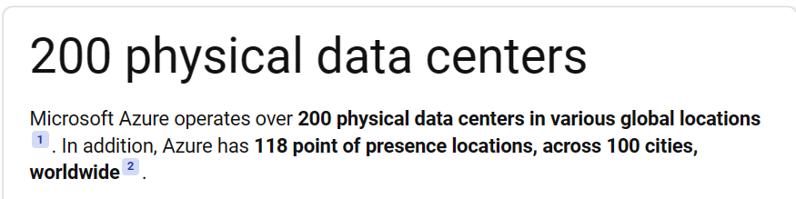
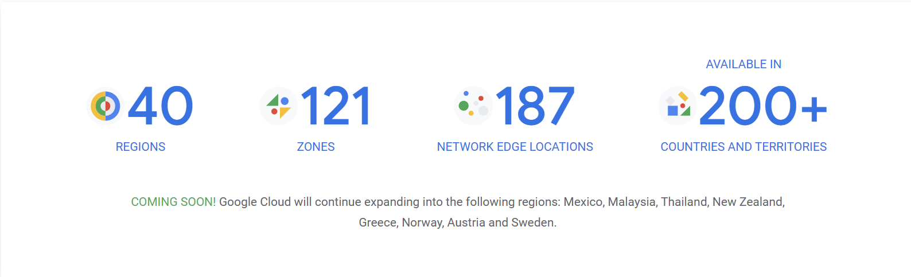

# Script - Final

This is the final presentation script.

Prepwork (before presentation):

- [ ] Devide windows --> Slide | Code | Info | Utils
- [ ] Deactivate conda environment
- [ ] Run Docker in the background
- [ ] pip uninstall azure-iot-device
- [ ] Slide: only contain slide
- [ ] Code: VSCode | Azure Portal *(full screen)*
- [ ] Info: Azure CLI Documentation, Region IoT (geography), IoT Hub pricing
- [ ] Utils: the rest.
- [ ] Exit Zalo, Messenger.
- [ ] Close all unnecessary tabs.
- [ ] Clean up workspace.
- [ ] restart explorer

## Introduction

- IoT demonstration --> Siri control music + Xuan control the light.
  
  > What is the biggest diff betw Siri and Xuan?
  >
  > Ans: Although both are voice assistant, Siri is in the cloud, Xuan is in the real world.

- The light is turned on and off physically. --> but have you ever wonder **How many servers to control smart lights?**
- Meme: How many servers to control lights?
  --> you can probly answer the question at the end of our talk.
- Welcome
  > - first class of this module
  > - glad to have all of you here
- Introduce the team
  > - Duong and along with me is Phú
- Sum up
  > - Since the very 1st week --> setup env
  > - Take our **first step** to **ditial agriculture** --> measure & monitor + auto watering
  > - That is only about **THINGS**, **building block** of the amazing world and we are missing something. --> take a look at the video
- Wreck It Ralph goto the internet video --> transition to Cloud.
- Ralph and Vanillope has already on the internet, but we haven't yet.
  > Let us guide you to the internet.

  - Will learn about concepts **The Cloud** and **Cloud IoT Service**. How to use one to talk to your devices with live demo. --> 

## The Cloud

- What is the cloud? --> What do you think when we talk about the Cloud?  
--> Show interview video.
- What makes the actual cloud in the sky? --> Water vapor, condensation, etc. --> Dense cluster of H2O molecules.
- Take this analogy to the cloud computing. --> Dense cluster of servers, connect to each other, and deliver a service. ==> Giant computing resource

    > Answer: The cloud is a network of servers, and each server has a different function. Some servers use computing power to run applications or "deliver a service". Others use their hard drive space to store data.

- Which problems can Cloud solve?

  > To greens and plants, cloud is where rain come from. --> provides hydration without human manually watering the plants.
  >
  > To a business (take example of VGU) --> currently do things "manually" --> physical server
- (VGU Data center) --> Take an example of server in our lab --> computing resources for using PC, other for E-Learning ILIAS, SIS etc.
  - Buying computers
  - Hardware maintenance
  - Power and cooling
  - Networking
  - Security, including securing the building and securing the software on the computers
  - Software installation and updates
- Talk about incident --> Traffic + Exam in ILIAS --> Server down. **almost like DDOS attack.**

    > DDOS simply use a lot of traffic to make the server down. It's like a lot of people go to the same place at the same time.

## The Cloud (continued)

- Cloud --> **jokingly says** *someone else's computer* e.g. Cloud Storage (Google Drive) *application is talk later*

    > Buying and installing the hardware, managing power and cooling, networking, building security, hardware and software updates, everything

    we will just rent the service from the cloud provider. Rent more as we need more. --> demand.

- Most cloud providers use Pay-As-You-Go model. --> Pay for what you use.
- Cloud providers have data centers all over the world. --> **Region** and **Geography**.

    > Region: A set of data centers deployed within a latency-defined perimeter and connected through a dedicated regional low-latency network.
    > Geography: A discrete market, typically containing two or more regions, that preserves data residency and compliance boundaries.

- Azure Physical Data Center
    
- Google Cloud Platform
    

Recall:

- **What is the cloud?** --> Network of servers, deliver a service, pay-as-you-go, region and geography.
- **Why do we use the cloud?** --> Scalability, reliability, security, and cost.

==> Move on to the services that cloud providers offer.

## Cloud IoT Service --> Phú

Phú present --> after introducing Azure IoT Hub.

## Azure IoT Hub

- In 1st class we use Eclipse Mosquitto --> MQTT Broker
- Azure IoT Hub --> MQTT Broker + more

  > Not a bus oriented, not a generic MQTT broker --> integration gateway with point-to-point **STAR TOPOLOGY** communication.  
  > - **No Device-to-Device communication.**

- Talk more about communication later when connect device to internet.

## Manage Azure IoT Hub

- 2 ways to manage Azure IoT Hub
  - Azure Portal
  - Azure CLI
- In this presentation, mostly use Azure CLI to manage --> at the end will demo with Portal.
- Reasons for using Azure CLI:
  - More flexible
  - More control
  - Dev friendly
  - For nerds =))

## Setup Azure CLI

- Refer to official docs --> show docs
- I setup docker env.
- Start docker `docker start -ai azure_connect`
  > `azure_connect` is for basic tasks
- Add extension `az extension add --name azure-iot`
  > `azure-iot` is service using.
  >
  > *If error, update dependancies:* `apk add --update python3 py-pip python3-dev cmake gcc g++ openssl-dev build-base`

- Login `az login`.
  > Copy code with **Ctrl+C**, paste with left_click.
- Wait status check.
- Check for account list --> `az account list --output table`

## Using Azure CLI --> Create Resource Group

- Introducing Resource Group
  > **A container** that holds related resources for an Azure solution.  
  > Generally, add resources that **share the same lifecycle** to the same resource group so you can **easily deploy, update, and delete them as a group.**
- Metadata about resources --> specify region for compliance with **data regulation**
- View region list --> `az account list-locations --output table`
- Hard to track --> refer to web Azure Geography.
- Create a resource group --> `az group create --name <name> --location <location>`
  > location: 'southeastasia` --> Vietnam.
- Show resource group in the portal.

## Create IoT Hub

- Create IoT Hub --> `az iot hub create --resource-group soil-moisture-sensor --sku F1 --partition-count 2 --name soil-moisture-sensor-fuisl`
- Take about a minute to create.
- What does SKU mean? Stock keeping unit, other meaning is type of service.
- Show tiers --> explain + base on need (scale, needs, features,...)
- Partition count: option define how many **stream of data** IoT Hub can handle. More partition, more data can handle, less data blocking --> **scalability**.
  > This value must be set when create free tier.
- Show IoT Hub in the portal *(if finished)*

## Communicate with IoT Hub

- Introducing communication with IoT Hub --> Phú
- In this demo, using:
  - Device-to-Cloud communication for time series telemetry data.
  - Direct methods for device management.
  > Recall direct method: **Request-Response** pattern. communication requires immediate confirmation of result.
- Show differences between C2D and Direct Method. *(if not mentioned)*
--> How to communicate with IoT Hub? --> **Device SDK**.
- Device SDK: **C, C#, Java, Node.js, Python**. --> using Python.
- Only registerd device can communicate with IoT Hub. --> 1st step is to register.

### Register Device

- Register device --> `az iot hub device-identity create --device-id <device_id> --hub-name <hub_name>`
- Show device in the portal.
- Registered --> How to communicate? --> **Connection String**.
  > Connection string: generic term for **piece of text** contains connection details.
- Get connection string --> `az iot hub device-identity show-connection-string --device-id <device_id> --hub-name <hub_name> --output table` *(you don't need `--output table`, this is for demo)*
- Explain connection string --> **Host Name**, **Device ID**, **Shared Access Key**.
  > - Host Name: DNS name of IoT Hub.
  > - Device ID: ID of the device.
  > - Shared Access Key: Key to authenticate the device.
- Security will be cover later.

### Storing connection string

- Not a good practice to store connection string in code. --> commit and sharing --> security risk.
- Store connection string in environment variable. --> use conda environment.
- Set conda env vars --> `conda env config vars set IOT_HUB_CONN_STR=<connection_string>`
- Check vars --> `conda env config vars list`

### Retrieve connection string

- Open VSCode --> code app.ipynb *(use notebook for easier to demo)*
- `import os` --> `os.getenv('IOT_HUB_CONN_STR')` store in `connection_string`.
- print `connection_string` --> show connection string.

### Install Device SDK

- Install Device SDK --> `pip install azure-iot-device`
- Add `import` --> `from azure.iot.device import IoTHubDeviceClient, Message`
  > Explain `Message` class. --> **Telemetry data**.
- Instead of using MQTT, we use Device SDK to communicate with IoT Hub.
- set client --> `client = IoTHubDeviceClient.create_from_connection_string(connection_string)`
- Call client method --> `client.connect()` & print status connected.

### Send Telemetry Data

- Start counterfit.

  ```python
  from counterfit_connection import CounterFitConnection
  CounterFitConnection.init() --> default localhost:5000
  ```

- Go to `localhost:5000` --> show the interface.
- Run code block --> set value for soil moisture sensor.

- setup sensor

    ```python
    from counterfit_shims_grove.adc import ADC
    import json --> data formating
    import time --> delay
    adc = ADC()
    ```

- send telemetry data

    ```python
    while True:
        soil_moisture = adc.read(0)
        print(f'soil_moisture: {soil_moisture}')
        msg = Message(json.dumps({'soil_moisture': soil_moisture}))
        client.send_message(msg)
        time.sleep(10)
    ```

- monitor the data --> `docker start -ai azure_monitor` --> `az iot hub monitor-events --device-id <device_id> --hub-name <hub_name> --output table`

==> successfully send telemetry data to IoT Hub.

### Control our device --> Invoke Direct Method

- add grove relay --> `from counterfit_shims_grove.grove_relay import GroveRelay`
- add `MethodResponse` --> `from azure.iot.device import MethodResponse`
  > MethodResponse class of a response to a direct method call.
- set relay pin 5 --> `relay = GroveRelay(5)`
- create relay on counterfit
- Direct method: **Request-Response** pattern.
- Create function to handle direct method.

    ```python
    def handle_method_request(request):
        print(f'Direct method received - {request.name}')

        if request.name == 'relay_on':
            relay.on()
        elif request.name == 'relay_off':
            relay.off()
        
        method_response = MethodResponse.create_from_method_request(request, 200)
        client.send_method_response(method_response)
    ```

- update handler --> `client.on_method_request_received = handle_method_request`
- Explain handle_method_request function.
  > `client` will call this function when receive direct method request. Set on_method_request_received --> set a **callback function**. --> Asynchronous operation run in the background.

- Invoke direct method --> `az iot hub invoke-device-method --device-id <device_id> --hub-name <hub_name> --method-name relay_on --method-payload {}`
- Show the relay on the counterfit.
- Invoke direct method to off using Portal.

==> Finish the demo --> summarize what we have done:

- Create IoT Hub
- Register device, get connection string and store in safe place.
- Use SDK to send telemetry data to IoT Hub and invoke direct method.

## Challenges

In the code provided send msg every 10 sec, but the free tier of IoT Hub allows 8,000 messages a day. How many messages a day is one message every 10 seconds? How can you change your code to stay within the free tier and check as often as needed but not too often? What if you wanted to add a second device?

- 10 sec/msg --> 0.1 msg/sec --> 0.1 *60* 60 * 24 = 8640 msg/day.
- Change delay to 10.8 sec --> 0.0926 msg/sec. --> 0.0926 *60* 60 * 24 = 8000 msg/day.
- Add a second drive --> 0.0926 *2* 60 *60* 24 = 16000 msg/day.

This number is ridiculous.

In real life application, especially in agriculture, we need to send data less frequently.

The ideal frequency for sending soil moisture data to an IoT Hub depends on a few factors:

- Plant needs: Different plants have varying water requirements. Sensitive plants might need readings every few minutes, while drought-resistant plants can be checked hourly or even less frequently.
- Soil type: Sandy soil dries out faster than clay-rich soil, so readings from sandy soil will need to be more frequent.
- Desired responsiveness: If you want real-time watering automation, readings will need to be more frequent than if you're just monitoring trends.
- Battery life (if applicable): More frequent transmissions consume more power. If your device is battery-powered, you'll need to balance data transmission with battery life.

  Here's a general guideline:

- For very sensitive plants or sandy soil: Every few minutes
- For most plants: Every 15-30 minutes
- For drought-resistant plants or clay soil: Every hour or even less

  Additional considerations:

- You can implement **thresholds.** Only send data when the moisture level goes above or below a certain point.
- You can implement **machine learning** to predict when the soil will need watering based on historical data.
- **Data aggregation** can be used to send data less frequently. For example, you can send an average of the moisture level every hour instead of sending every reading.
- It's best to start with a higher frequency and then adjust based on your specific needs and battery life constraints. You can monitor the data in your IoT Hub to see how the moisture levels fluctuate and fine-tune the sending frequency from there.

## Assignment

- IaaS
  - offers essential compute
  - storage
  - and networking resources
  > on demand, on a pay-as-you-go basis.

  > IaaS --> cost and complexity **buying and managing** physical servers and datacenter **infrastructure**. Each resource is offered as a separate service component, and you **only pay for a particular resource for as long as you need it**. A cloud computing service provider like Azure manages the infrastructure, while **you purchase, install, configure, and manage your own software—including operating systems, middleware, and applications.**
  - Pros: cheapest, more control, more flexible
  - Cons: more management, more complex, more time-consuming.
- PaaS:
  > - **Development framework**. PaaS provides a framework that developers can build upon to develop or customize cloud-based applications.
  > - Similar to the way you create an **Excel macro**, PaaS lets developers create applications using **built-in software components**. Cloud features such as scalability, high-availability, and multi-tenant capability are included, reducing the amount of coding that developers must do.
  > - Analytics or business intelligence. Tools provided as a service with PaaS allow organizations to analyze and mine their data, finding insights and patterns and predicting outcomes to improve forecasting, product design decisions, investment returns, and other business decisions.
  > - Additional services. PaaS providers may offer other services that enhance applications, such as **workflow, directory, security, and scheduling.**
  - Pros: less management, less complex, less time-consuming.
  - Cons: less control, less flexible, more expensive.

  
