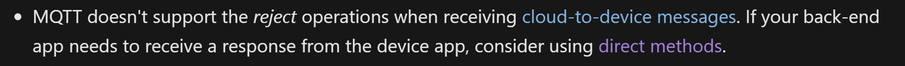
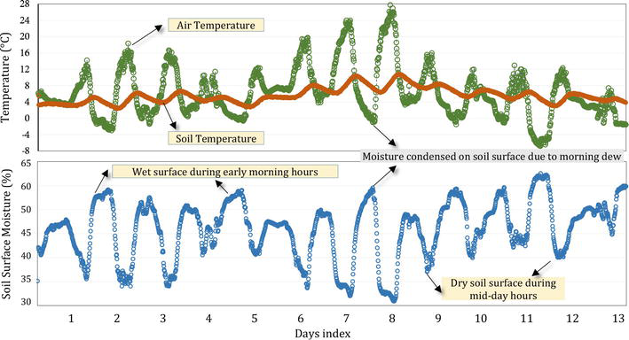

# Script

## Prep work

- [ ] Deactivate conda environment
- [ ] Clean up resource group for demo
- [ ] Conda environment clear up
- [ ] Docker container clear (but keep the image)
- [ ] Azure CLI documentation
- [ ] Region for IoT Hub page
- [ ] Azure IoT Hub pricing
- [ ] Azure Portal
- [ ] uninstall azure-iot-device

References:

- [smart farming](https://www.youtube.com/watch?v=gfCEQgx4d-4)

## Slide 0

- Joke: internet of shit.
- Cloud storage.
- **TODO:** need something here.

## Slide 1: Introduction

- Greetings.
- Group introduction
  - duong and phu
- Topic introduction
  - Cloud.

## Sum up previous lectures

- In the very 1st week, already learned about seting up environment for learning, coding & working with IoT devices (virtual devices)
- Last lec --> digital farming --> changing the course of argiculture.
- predicted plant growth, monitoring, calculate moisture and setup automated watering system
- It was Thing, and now we focus on the I, stands for Internet.
--> questioning with "How do you define a cloud?" --> short interview? --> introducing Cloud computing

## Cloud presentation

TODO: write script introducing cloud.

## IoT Services --> IoT Azure Hub

- Method on controlling (1) web-base portal, (2) Azure CLI
- More about Azure Hub
- Endpoint.

Internally, the Azure IoT Hub is not a bus oriented, it's not a generic MQTT Broker, it's not a generic communication broker, it is an integration gateway with a point-to-point star topology communications such as Device-To-Cloud (D2C) and Cloud-To-Device (C2D) messaging. There is no direct Device-To-Device messaging.

> Direct methods follow a request-response pattern and are meant for communications that require immediate confirmation of their result. For example, interactive control of the device, such as turning on a fan.

Diff between direct methods and cloud-to-device messages.



### Installing Azure CLI

- Refer to Azure CLI Documentation --> enter the link --> show instruction on Windows/Macbook
- I already setup my Azure CLI in a docker container

  ```bash
  docker start -ai recursing_chaum
  ```

  > _Note:_ recursing_chaum with underscore.

- Now add the extension for IoT Hub

  ```bash
  az extension add --name azure-iot
  ```

  > _This goes with dependencies:_
  
    ```bash
    apk add --update python3 py-pip python3-dev cmake gcc g++ openssl-dev build-base
    ```

--> Now we can use the Azure CLI to control the IoT Hub.

- Login with your created Azure account

  ```bash
  az login
  ```

- Check for account lists

  ```bash
  az account list --output table
  ```

### Using Azure CLI

- Start off with create a resource group --> TODO: Research research group (reason why using + creating)
- Check for list of hosting locations. Using the following command to view

    ```bash
    az account list-locations --output table
    ```

  But this would be hard to track --> refer to link for [Azure Geography](https://azure.microsoft.com/en-us/explore/global-infrastructure/geographies/?WT.mc_id=academic-17441-jabenn#overview)
  
- Create a resource group

  ```bash
  az group create --name soil-moisture-sensor --location southeastasia
  ```

### Create an IoT Hub

- Create an IoT Hub

  ```bash
  az iot hub create --resource-group soil-moisture-sensor --sku F1 --partition-count 2 --name soil-moisture-sensor-fuisl
  ```

  > *IoT Hub will take a minute to create. --> should talk about partition while creating.*

  - DNS name of the IoT Hub must be globally unique `{name}.azure-devices.net`
  - will not go into details since will be mentioned later with the other group.

  > _Note:_ F1 is the free tier, and partition-count is the number of partitions to be used for the IoT Hub.

  There are plenty of tiers to choose from, refer to the [Azure IoT Hub Pricing](https://azure.microsoft.com/en-us/pricing/details/iot-hub/?WT.mc_id=academic-17441-jabenn) --> show and compare the pricing + needs.

  The `--partition-count 2` option defines how many streams of data the IoT Hub supports, more partitions reduce data blocking when multiple things read and write from the IoT Hub. Partitions are outside the scope of these lessons so I will explain just a little.

  These partitions serve two primary purposes:

  1. Scaling: They allow for scaling of the IoT Hub itself (similar to how Event Hubs scale).
  2. Consumer App Scaling: They facilitate scaling out the consumer application that reads events from the hub.
  
  Essentially, partitions help manage the flow of incoming telemetry data reported by various IoT devices. *this value needs to be set to create a free tier IoT Hub.*

### Communicating with Hub

- In this project, we will be using device-to-cloud messages for time series telemetry and alerts.
- Direct methods for communications that require immediate confirmation of the result. Direct methods are often used for interactive control of devices such as turning on a fan.
--> talk about direct method. TODO: Research more about [direct method](https://learn.microsoft.com/en-us/azure/iot-hub/iot-hub-devguide-direct-methods)
  > *Direct methods follow a request-response pattern and are meant for communications that require immediate confirmation of their result. For example, interactive control of the device, such as turning on a fan.*

### Connect device to IoT Service

Once the hub is created, your IoT device can connect to it. Only registered devices can connect to a service, so you will need to register your device first. When you register you can get back a connection string that the device can use to connect. This connection string is device specific, and contains information about the IoT Hub, the device, and a secret key that will allow this device to connect.

> 🎓 A connection string is a generic term for a piece of text that contains connection details. These are used when connecting to IoT Hubs, databases and many other services. They usually consist of an identifier for the service, such as a URL, and security information such as a secret key. These are passed to SDKs to connect to the service.

> ⚠️ Connection strings should be kept secure! Security will be covered in more detail in a future lesson.

#### Register your IoT device

The IoT device can be registered with your IoT Hub using the Azure CLI.

1. Run the following command to register a device:

    ```sh
    az iot hub device-identity create --device-id soil-moisture-sensor --hub-name <hub_name>
    ```

    Replace `<hub_name>` with the name you used for your IoT Hub.

    This will create a device with an ID of `soil-moisture-sensor`.

1. When your IoT device connects to your IoT Hub using the SDK, it needs to use a connection string that gives the URL of the hub, along with a secret key. Run the following command to get the connection string:

    ```sh
    az iot hub device-identity connection-string show --device-id soil-moisture-sensor --output table --hub-name <hub_name>
    ```

    Replace `<hub_name>` with the name you used for your IoT Hub.

1. Store the connection string that is shown in the output as you will need it later.

    > *Here is a guidance on how to store it in your environment variable. (using conda)*

    1. Set the environment variable. This can be done in a various way. One way to do it with **anaconda CLI**. Command:

        ```shell
        conda env config vars set IOT_HUB_CONN_STR=<connection_string>
        ```

    1. Check if the environment variable is set. Command:

        ```shell
        conda env config vars list
        ```

        Now have env --> retrieve it using module: `os`

    1. Using the environment variable in the code:

        ```python
        import os

        connection_string = os.getenv('IOT_HUB_CONN_STR')
        ```

        Use the `connection_string` to connect to the IoT Hub.

## Connect your IoT device to the cloud - Virtual IoT Hardware and Raspberry Pi

In this part of the lesson, you will connect your virtual IoT device or Raspberry Pi to your IoT Hub, to send telemetry and receive commands.

### Connect your device to IoT Hub

The next step is to connect your device to IoT Hub.

#### Task - connect to IoT Hub

1. run conda environment for iot

1. open folder `soil-moisture-sensor'

1. Open the `soil-moisture-sensor` folder in VS Code. Make sure the virtual environment is running in the terminal if you are using a virtual IoT device.

1. Install some additional Pip packages:

    ```sh
    pip3 install azure-iot-device
    ```

    `azure-iot-device` is a library to communicate with your IoT Hub.

1. Add the following imports to the top of the `app.py` file, below the existing imports:

    ```python
    from azure.iot.device import IoTHubDeviceClient, Message, MethodResponse
    ```

    This code imports the SDK to communicate with your IoT Hub.

1. We won't be using MQTT to communicate, instead we use SDK so no need to use paho.mqtt

1. Add the following code below the import statements (if you haven't setup your environment variable yet. **This is not best practice.**) --> more about security on another lecture.

    ```python
    connection_string = "<connection string>"
    ```

1. Below this code, add the following to create a device client object that can communicate with IoT Hub, and connect it:

    ```python
    device_client = IoTHubDeviceClient.create_from_connection_string(connection_string)

    print('Connecting')
    device_client.connect()
    print('Connected')
    ```

1. Run this code. You will see your device connect.

    ```output
    (iot) iot/soil-moisture-sensor $ python3 app.py 
    Connecting
    Connected
    Soil moisture: 379
    ```

### Send telemetry

Now that your device is connected, you can send telemetry to the IoT Hub instead of the MQTT broker (Eclipse Mosquitto broker).

#### Task - send telemetry

1. Add the following code inside the `while True` loop, just before the sleep:

    ```python
    message = Message(json.dumps({ 'soil_moisture': soil_moisture }))
    device_client.send_message(message)
    ```

    This code creates an IoT Hub `Message` containing the soil moisture reading as a JSON string, then sends this to the IoT Hub as a device to cloud message.

### Handle commands

Your device needs to handle a command from the server code to control the relay. This is sent as a direct method request.

### Task - handle a direct method request

1. Add the following code before the `while True` loop:

    ```python
    def handle_method_request(request):
        print("Direct method received - ", request.name)
    
        if request.name == "relay_on":
            relay.on()
        elif request.name == "relay_off":
            relay.off()    
    ```

    This defines a method, `handle_method_request`, that will be called when a direct method is called by the IoT Hub. Each direct method has a name, and this code expects a method called `relay_on` to turn the relay on, and `relay_off` to turn the relay off.

    > 💁 This could also be implemented in a single direct method request, passing the desired state of the relay in a payload that can be passed with the method request and available from the `request` object.

1. Direct methods require a response to tell the calling code that they have been handled. Add the following code at the end of the `handle_method_request` function to create a response to the request

    > this is a response with an HTTP status code of 200, indicating success and send it back to the IoT Hub:

    ```python
    method_response = MethodResponse.create_from_method_request(request, 200)
    device_client.send_method_response(method_response)
    ```

    This code sends a response to the direct method request with an HTTP status code of 200, and sends this back to the IoT Hub.

1. Add the following code below this function definition:

    ```python
    device_client.on_method_request_received = handle_method_request
    ```

    This code tells the IoT Hub client to call the `handle_method_request` function when a direct method is called.

    > The `device_client` is an instance of the `IoTHubDeviceClient` class from the Azure IoT SDK. This class is designed to handle communication with the Azure IoT Hub, including sending telemetry data and handling direct method requests.

    > When you assign a function to `device_client.on_method_request_received`, you're setting a _callback function_ that the SDK will call whenever a direct method request is received from the IoT Hub. This is an **asynchronous operation that runs in the background**, separate from the main execution flow of your script.

    > This means that once the callback is set, it will be called whenever a direct method request is received, without the need for a continuous loop in your script. The SDK handles the continuous listening for direct method requests in the background.

After this step, you've finished connecting your device to the cloud.

#### Task - monitor events

For now, you won't be updating your server code. Instead you can use the Azure CLI to monitor events from your IoT device.

1. Make sure your IoT device is running and sending soil moisture telemetry values

1. Run the following command in your command prompt or terminal to monitor messages sent to your IoT Hub:

    ```sh
    az iot hub monitor-events --hub-name <hub_name>
    ```

    You will see messages appear in the console output as they are sent by your IoT device.

    The contents of the `payload` will match the message sent by your IoT device.

#### Task - control your IoT device

You can also use the Azure CLI to call direct methods on your IoT device.

1. Run the following command in your command prompt or terminal to invoke the `relay_on` method on the IoT device:

    ```sh
    az iot hub invoke-device-method --device-id soil-moisture-sensor \
                                    --method-name relay_on \
                                    --method-payload '{}' \
                                    --hub-name <hub_name>
    ```

    Replace `<hub_name>` with the name you used for your IoT Hub.

    This sends a direct method request for the method specified by `method-name`. Direct methods can take a payload containing data for the method, and this can be specified in the `method-payload` parameter as JSON.

    You will see the relay turn on, and the corresponding output from your IoT device:

    ```output
    Direct method received -  relay_on
    ```

1. We can repeat the above step for `relay_off` but I will demo on Azure Portal.

## Challenges

1. Do the math: how much data can you send to the IoT Hub per month with the free tier?

  Free tier $8000 msgs/day$  
  with $6 msgs/min$ --> $6*60*24 = 8640 msgs/day$  
  -> exceed F1 limit.

  Solution:

- The exact number is 10.8 seconds per message.
- in a report they use 10 minutes interval, so 144 msgs/day --> 144*30 = 4320 msgs/month

  

  The ideal frequency for sending soil moisture data to an IoT Hub depends on a few factors:

  - Plant needs: Different plants have varying water requirements. Sensitive plants might need readings every few minutes, while drought-resistant plants can be checked hourly or even less frequently.
  - Soil type: Sandy soil dries out faster than clay-rich soil, so readings from sandy soil will need to be more frequent.
  - Desired responsiveness: If you want real-time watering automation, readings will need to be more frequent than if you're just monitoring trends.
  - Battery life (if applicable): More frequent transmissions consume more power. If your device is battery-powered, you'll need to balance data transmission with battery life.

  Here's a general guideline:

  - For very sensitive plants or sandy soil: Every few minutes
  - For most plants: Every 15-30 minutes
  - For drought-resistant plants or clay soil: Every hour or even less

  Additional considerations:

  - You can implement thresholds. Only send data when the moisture level goes above or below a certain point.
  - Some sensors can take continuous measurements and transmit them at set intervals.
  - It's best to start with a higher frequency and then adjust based on your specific needs and battery life constraints. You can monitor the data in your IoT Hub to see how the moisture levels fluctuate and fine-tune the sending frequency from there.

<!-- ## Terminologies

- JSON: JavaScript Object Notation
- IoT Hub: a central point for IoT devices to connect to the cloud
- Device: a physical or virtual object that connects to the IoT Hub
- Device Twin: a JSON document that stores device state information
- Device Identity: a unique identifier for a device
- Device Module: a logical unit of functionality that can be deployed to a device
- Device Module Twin: a JSON document that stores module state information
- Device Module Identity: a unique identifier for a module -->

## Code for connecting (final)

``` python
from counterfit_connection import CounterFitConnection
CounterFitConnection.init('127.0.0.1', 5000)

import time
from counterfit_shims_grove.adc import ADC
from counterfit_shims_grove.grove_relay import GroveRelay
import json
from azure.iot.device import IoTHubDeviceClient, Message, MethodResponse
 
import os
connection_string = os.getenv('IOT_HUB_CONN_STR')

adc = ADC()
relay = GroveRelay(5)

device_client = IoTHubDeviceClient.create_from_connection_string(connection_string)

print('Connecting')
device_client.connect()
print('Connected')

def handle_method_request(request):
    print("Direct method received - ", request.name)
    
    if request.name == "relay_on":
        relay.on()
    elif request.name == "relay_off":
        relay.off()

    method_response = MethodResponse.create_from_method_request(request, 200)
    device_client.send_method_response(method_response)

device_client.on_method_request_received = handle_method_request

while True:
    soil_moisture = adc.read(0)
    print("Soil moisture:", soil_moisture)

    message = Message(json.dumps({ 'soil_moisture': soil_moisture }))
    device_client.send_message(message)

    time.sleep(20)

```